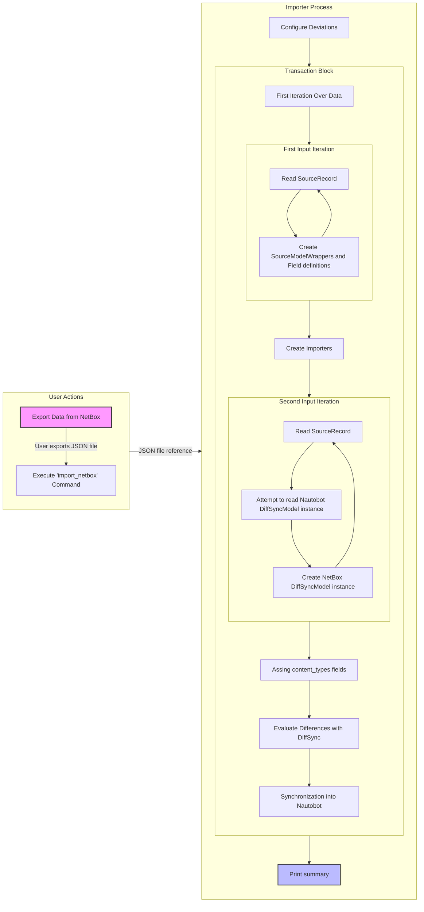

# Data Flow

This document illustrates the data flow from NetBox to Nautobot.

A detailed description of the individual steps can be found in the developer [Generator Documentation](./generator.md#stages) or the user [Using the App](../user/app_use_cases.md) documentation.

## Data Export

The user exports data from NetBox into a JSON file, [described here](../user/app_use_cases.md#getting-a-data-export-from-netbox).
   
## Import Execution

The user executes the `nautobot-server import_netbox` command to initiate the import process by passing the JSON file reference as an argument, [described here](../user/app_use_cases.md#importing-data-into-nautobot).

## Initial Setup

The importer initializes by setting up the following objects:

- `NetBoxAdapter` and `NautobotAdapter` instances to interact with the respective systems.
- `configure_model()` is used to define deviations between NetBox and Nautobot data models, resulting in a `SourceModelWrapper` instance for each content type.
    - It generates `SourceField` instances based on the provided configuration.
        - Field definitions are stored for the later creation of importers.
    - Creates a `NautobotModelWrapper` for each mapped Nautobot content type.

## Transaction Processing

A database transaction begins, encompassing the steps below:

- The `NetBoxAdapter` employs `get_source_data()` to retrieve and iterate over NetBox data:
    - Each piece of data is represented as a `SourceRecord` containing a `content_type` string and a `data` dictionary.
    - The importer constructs its internal hierarchy by establishing `SourceModelWrapper` instances for each content type, which include `SourceField` instances for each key found in the `data` dictionary.
- The importer generates field importers for each `SourceModelWrapper`, mapping each field to a corresponding `NautobotField` using `field.set_importer(<source importer>, <nautobot field name>)`.
    - It may disable field import based on specific conditions, such as defining a field as `None` or in case of absent Nautobot fields.
    - Then it establishes an importer according to the Nautobot field type or using a custom field definition.
- The importer goes through the JSON file a second time, processing each `SourceRecord` to enact the relevant import actions for each content type.
    - This can involve creating `DiffSyncModel` instances and storing them using `NetBoxAdapter`.
    - For each `DiffSyncModel` instance created, it attempts to load the Nautobot object from the database as another `DiffSyncModel` instance and store it using `NautobotAdapter`.
- Post-import actions are invoked for each `SourceModelWrapper`, where `content_types` fields values are assigned based on the references cached during data import.
- The importer evaluates the differences (a "diff") between NetBox and Nautobot data sets.
- DiffSync, an internal mechanism, is used to synchronize data into Nautobot's database following the comparison.
- Any Nautobot objects that faced validation issues during synchronization are checked using `clean()`, which captures the issues within `ImporterIssue` instances.

## Finalization

A summary of the import operation is presented at the end.
