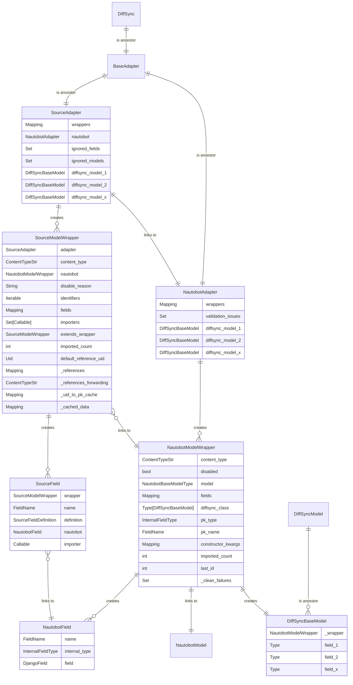

# Generator Documentation

This document details the generator structure, which is responsible for importing data from NetBox to Nautobot.

## Overview

The implementation is divided into two components: generic and NetBox specific.

### Generic Component

The generic component encompasses the `NautobotAdapter` and `SourceAdapter` capable of generating `DiffSyncModel` classes based on the input data, the current version of Nautobot, and any deviations defined in the source configuration.

It comprises the following modules, located in the `nautobot_netbox_importer/generator` directory:

- `base.py`: Implements base classes and utilities utilized throughout the application, also establishing constants and shared type definitions.
- `nautobot.py`: Provides the `NautobotAdapter`, along with `NautobotModelWrapper` and `NautobotField` classes that define the Nautobot structure.
- `source.py`: Offers the `SourceAdapater`, `SourceModelWrapper` and `SourceField` classes that define the source structure.
- `fields.py`: Contains factories for fields deviation definitions.
- `summary.py`: Supplies utility functions for summarizing data structures and presenting import statistics.

### NetBox Specific Component

The NetBox specific component is further segmented into sections, located in the `nautobot_netbox_importer/diffsync` directory:

- `adapters/nautobot.py`: Inherits `NautobotAdapter` from the generic `NautobotAdapter` and implements pieces necessary for SSoT job.
- `adapters/netbox.py`: Inherits `NetBoxAdapter` from the generic `SourceAdapter` and implements the data reader and importer that facilitate the transition from NetBox to Nautobot.
- `models/` directory: Contains individual module files that define deviations and field mappings from NetBox to Nautobot.

## Stages

The import process consists of the following stages:

### Defining a Source Data

The initial step involves creating a `SourceAdapter()`. It accepts an argument, `get_source_data`, which is `Callable` that returns `Iterable` of the source data items. Each source data item is encapsulated in `SourceRecord(content_type: ContentTypeStr, data: Dict)` instances. `SourceAdapter` constructor also passes any additional arguments to its ancestor, the `DiffSync` class.

The data undergoes two cycles: the first to establish the structure and the second to import the actual data, as described in the following sections.

### Defining the Source Structure Deviations

Before importing, it is essential to define any deviations between the source structure and the target Nautobot structure.

This is achieved through `adapter.configure_model(content_type: ContentTypeStr)`. You can specify additional arguments such as:

- `nautobot_content_type`: Define this when the Nautobot content type differs from the source.
- `identifiers`: A list of fields identifiable as unique references in the source data.
- `default_reference`: A `RecordData` dictionary of default values to reference this model. This is useful when the source data does not provide a reference that is required in Nautobot.
- `extend_content_type`: Define this when a source model extends another source model to merge into a single Nautobot model.
- `fields`: Define the source fields and how they should be imported. This argument is a dictionary mapping `FieldName` to `SourceFieldDefinition` instances.
    - `SourceFieldDefinition` can be one of:
        - `None`: to ignore the field.
        - A Nautobot `FieldName` to rename the field.
        - A `Callable` for specialized field handling, for example, `_role_definition_factory(adapter, "dcim.rackrole")`, which maps the `role` field to the `dcim.rackrole` content type.

To disable specific content types, use `adapter.disable_model(content_type: ContentTypeStr, reason: str)`.

### Reading Source Structure

The first data iteration constructs the wrapping structure, which includes:

- `SourceAdapter` with all source model `adapter.wrappers`.
    - The `SourceAdapter` manages `SourceModelWrapper` and `NautobotModelWrapper` instances.
- A `SourceModelWrapper` for each source content type, with `source_wrapper.fields` detailing how to import the source data.
    - Each `SourceModelWrapper` instance corresponds to a single `NautobotModelWrapper` instance.
- A `NautobotModelWrapper` for each Nautobot content type, detailing `nautobot_wrapper.fields` and types, aiding in constructing the `DiffSyncModel` instances.
    - A single `NautobotModelWrapper` instance can be referenced by multiple `SourceModelWrapper` instances.

During this phase, all non-defined but present source fields are appended to the `source_wrapper.fields`, focusing on field names, not values.

### Creating Source Importers

Convert each `source_wrapper.fields` item into a callable based on previously-established field definitions. The callables convert the source data into the `DiffSyncModel` constructor's expected structure.

In this stage, the structure described in the previous section is enhanced.

### Importing the Data

During this stage, the system performs a second iteration over the input data. This process involves converting the input data into instances of `DiffSyncModel` by calling the importers defined in the previous step.

Each `DiffSyncModel` class is dynamically generated as needed. The fields within a `DiffSyncModel` are defined using `nautobot_wrapper.fields`. These fields map directly to the attributes of the source data.

For each source record, the importer attempts to read the corresponding Nautobot objects as well, based on the `identifiers` if they are defined in the source model, or on a generated record's primary key. The primary key is deterministically generated using UUID5, based on the source content type and primary key. If the source primary key is already a UUID, it is passed through without change.

### Updating Referenced Content Types

The updating of `content_types` fields, based on cached references, occurs in this phase. It's possible to define forwarding references using `source_wrapper.set_references_forwarding()`, e.g. references to `dcim.location` are forwarded to `dcim.locationtype`.

### Syncing to Nautobot

Data sync to Nautobot is executed using `nautobot_adapter.sync_from(source_adapter)` from the `diffsync` library. The `object.save()` method is used, accommodating objects that fail `object.clean()`. These objects are verified in the following step.

### Validating the Data

After saving all objects, the system verifies the data consistency by re-running `clean()` on objects that failed during the previous step. All validation errors are collected and can be displayed to the user.

### Committing the Transaction

The entire process described above must be encapsulated within a single transaction to ensure atomicity. This approach allows the execution of database statements that may temporarily violate database constraints, with the understanding that these violations will be resolved by the end of the transaction.

If any failure occurs during the process, a rollback is triggered, undoing all changes made during the import process.

## ER Diagram

Illustrated below is the ER diagram for the generator structure, created to import data from source to Nautobot.

## Other Techniques

- Generating deterministic primary keys for Nautobot objects based on the source identifiers using UUID5.
- Skipping absent Nautobot models and fields.
- Normalizing `datetime` values.
- Stabilizing import order.
- Caching:
    - Pre-defined records.
    - Source identifiers to Nautobot primary keys.
    - Content type objects.
    - Referencing content types to objects to autofill `content_types` fields.
- Using Nautobot default values to fill in missing source data.
- Auto set-up importers for relation fields.
- Storing content type back mapping.

