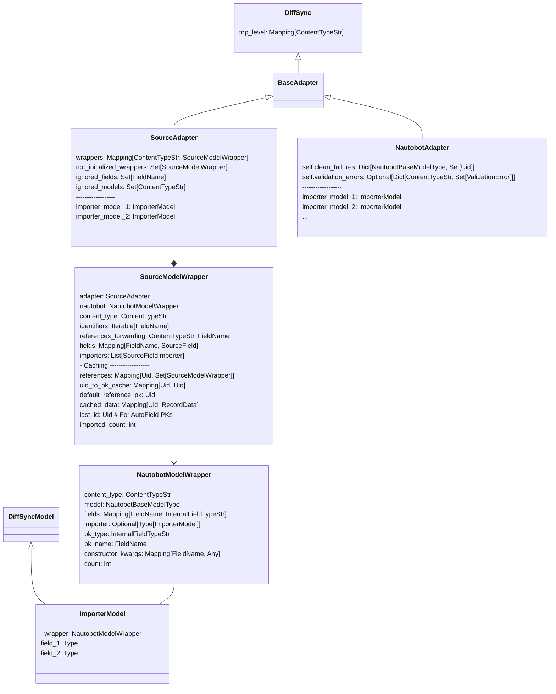

# Importer Documentation

This document details the importer process,

## Stages

The importer process consists of the following stages:

### Defining the Source Structure Deviations

Before importing, it is essential to define any deviations between the source structure and the target Nautobot structure. This is configured within `nautobot_plugin_netbox_importer/diffsync/netbox.py`.

The initial step requires creating a `SourceAdapter()`. The following adjustments can be defined using the adapter:

- Use `adapter.ignore_models()` to skip certain source models during the import.
- Use `adapter.ignore_fields()` to skip specific fields across all models.

Customize individual models that differ from the Nautobot model using `SourceModelWrapper()`. This is achieved through `adapter.define_model(content_type: ContentTypeStr)`. You can specify additional parameters like:

- `nautobot_content_type`: Define this when the Nautobot content type differs from the source.
- `identifiers`: List of fields that are identifiable as unique references in the source data.

Next, configure the `SourceModelWrapper()` to handle:

- Forward references using `source_wrapper.set_forwarding_references(target_content_type: ContentTypeStr, relation_field_name: FieldName)`. This helps to correctly associate `content_types` fields, such as `LocationType`, when the source references `Site`, `Region`, or `Location`.
- Set a default reference using `source_wrapper.set_default_reference(**data)`. These defaults fill in data for absent source references that must be specified in Nautobot, such as `Status`.
- Provide default values for Nautobot model instances with `source_wrapper.nautobot.set_instance_defaults(**defaults)`.

Field customization is possible via `source_wrapper.set_fields(**fields)` by:

- Ignoring a field using `set_fields(field_name=None)`.
- Renaming a field using `set_fields(field_name="new_field_name")`.
- Assigning a `Callable` for specialized field handling, e.g., `set_fields(role=_role_definition_factory("dcim.rackrole")`, which maps the `role` field to the `dcim.rackrole` content type.

### Defining Source Data

To input source data, use `adapter.import_data(get_source_data: SourceDataGenerator)`. The data goes through two cycles: first to establish the structure and then to import actual data. Source data are encapsulated as `SourceRecord(content_type: ContentTypeStr, data: Dict)` instances.

### Reading Source Structure

The first data iteration constructs the wrapping structure, which includes:

- `SourceAdapter` with all source model `adapter.wrappers`.
    - The `SourceAdapter` manages `SourceModelWrapper` and `NautobotModelWrapper` instances.
- A `SourceModelWrapper` for each source content type, with `source_wrapper.fields` detailing how to import the source data.
    - Each `SourceModelWrapper` instance corresponds to a single `NautobotModelWrapper` instance.
- A `NautobotModelWrapper` for each Nautobot content type, detailing `nautobot_wrapper.fields` and types, aiding in constructing the `DiffSyncModel` importer.
    - A single `NautobotModelWrapper` instance can be referenced by multiple `SourceModelWrapper` instances.

During this phase, all non-defined but present source fields are appended to the `source_wrapper.fields`, focusing on field names, not values.

### Creating Source Importers

Convert each `source_wrapper.fields` item into a callable based on previously-established field definitions. The callables convert the source data into the `DiffSyncModel` constructor's expected structure.

In this stage, the structure described in the previous section is enhanced.

### Importing the Data

This stage involves the second data iteration, where `DiffSyncModel` instances are dynamically created and populated with imported data, matching the Nautobot models.

### Updating Referenced Content Types

The updating of `content_types` fields, based on cached references, occurs in this phase.

### Reading Nautobot Data

`NautobotAdapter()` initiates and reads from the Nautobot database, considering only content type models with at least one instance of imported data.

### Syncing to Nautobot

Data sync to Nautobot is executed using `nautobot_adapter.sync_from(source_adapter)` from the `diffsync` library. The `instance.save()` method is used, accommodating instances that fail `instance.clean()`. These instances are stored for subsequent verification after the transaction is committed.

### Validating the Data

After saving all instances, the system verifies the data consistency by re-running `clean()` on instances that failed during the sync.

### Committing the Transaction

The entire process described above must be encapsulated within a single transaction to ensure atomicity. This approach allows the execution of database statements that may temporarily violate database constraints, with the understanding that these violations will be resolved by the end of the transaction.

If any failure occurs during the process, a rollback is triggered, undoing all changes made during the import process.

## Class Diagram

Illustrated below is the class diagram for the importer structure.

