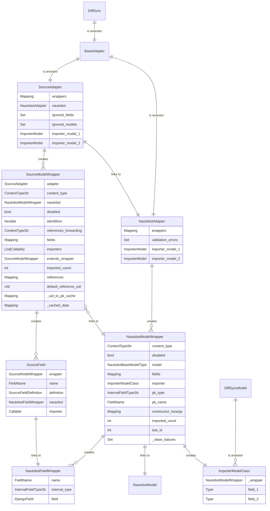

# Importer Documentation

This document details the importer process.

## Overview

Within the `nautobot_netbox_importer/diffsync` directory, you'll find the DiffSync related code, modularized into distinct components, each serving a unique purpose within the system:

### [Base](../../nautobot_netbox_importer/diffsync/base.py)

Implements base classes and utilities used across the application, also defining constants and shared types.

### [Nautobot](../../nautobot_netbox_importer/diffsync/nautobot.py)

Acts as the Nautobot adapter, model wrappers and detailing field mappings specific to Nautobot. Depends on `base.py`.

### [Source](../../nautobot_netbox_importer/diffsync/source.py)

Sets up a generic source adapter, inclusive of model wrappers and field mappings. Depends on `base.py` and `nautobot.py`.

### [NetBox](../../nautobot_netbox_importer/diffsync/netbox.py)

Serves as the source adapter for NetBox data imports into Nautobot, building upon the generic source adapter. Depends on `source.py`, `nautobot.py`, and `base.py`.

### [Summary](../../nautobot_netbox_importer/diffsync/summary.py)

Provides utility functions for summarizing data structures and displaying import statistics, leveraging the adapters introduced in `nautobot.py` and `source.py`.

## Stages

The importer process consists of the following stages:

### Defining the Source Structure Deviations

Before importing, it is essential to define any deviations between the source structure and the target Nautobot structure. This is configured within `nautobot_plugin_netbox_importer/diffsync/netbox.py`.

The initial step requires creating a `SourceAdapter()`. To configure global importer settings, use `adapter.configure()`. The following arguments are available:

- `ignore_content_types` to skip certain source models during the import.
- `ignore_fields` to skip specific fields across all models.

Customize individual models that differ from the Nautobot model using `SourceModelWrapper()`. This is achieved through `adapter.configure_model(content_type: ContentTypeStr)`. You can specify additional arguments like:

- `nautobot_content_type`: Define this when the Nautobot content type differs from the source.
- `disable`: To disable the import of this model.
- `identifiers`: List of fields that are identifiable as unique references in the source data.
- `default_reference`: `RecordData` dictionary of default value to reference this model. This is useful when the source data does not specify a reference that is required in Nautobot.
- `extend_content_type`: Define, when this source model extends another source model to merge into single Nautobot model.
- `fields`: Define the source fields and how to import them. This argument is a dictionary of `FieldName` to `SourceFieldDefinition` instances.
    - `SourceFieldDefinition` can be one of:
        - `None`: to ignore the field.
        - Nautobot `FieldName` to rename the field.
        - `Callable` for specialized field handling, e.g., `_role_definition_factory(adapter, "dcim.rackrole")`, which maps the `role` field to the `dcim.rackrole` content type.

### Defining Source Data Generator

To input source data, use `adapter.import_data(get_source_data: SourceDataGenerator)`. The data goes through two cycles: first to establish the structure and then to import actual data. Source data are encapsulated as `SourceRecord(content_type: ContentTypeStr, data: Dict)` instances.

### Reading Source Structure

The first data iteration constructs the wrapping structure, which includes:

- `SourceAdapter` with all source model `adapter.wrappers`.
    - The `SourceAdapter` manages `SourceModelWrapper` and `NautobotModelWrapper` instances.
- A `SourceModelWrapper` for each source content type, with `source_wrapper.fields` detailing how to import the source data.
    - Each `SourceModelWrapper` instance corresponds to a single `NautobotModelWrapper` instance.
- A `NautobotModelWrapper` for each Nautobot content type, detailing `nautobot_wrapper.fields` and types, aiding in constructing the `DiffSyncModel` importer.
    - A single `NautobotModelWrapper` instance can be referenced by multiple `SourceModelWrapper` instances.

During this phase, all non-defined but present source fields are appended to the `source_wrapper.fields`, focusing on field names, not values.

### Creating Source Importers

Convert each `source_wrapper.fields` item into a callable based on previously-established field definitions. The callables convert the source data into the `DiffSyncModel` constructor's expected structure.

In this stage, the structure described in the previous section is enhanced.

### Importing the Data

During this stage, the system performs a second iteration over the input data. This process involves converting the input data into instances of `DiffSyncModel` by calling the importers defined in the previous step.

Each `DiffSyncModel` class is dynamically generated as needed. The fields within a `DiffSyncModel` are defined using `nautobot_wrapper.fields`. These fields map directly to the attributes of the source data.

### Updating Referenced Content Types

The updating of `content_types` fields, based on cached references, occurs in this phase. It's possible to define forwarding references using `source_wrapper.set_references_forwarding()`, e.g. references to `dcim.location` are forwarded to `dcim.locationtype`.

### Reading Nautobot Data

`NautobotAdapter()` reads from the Nautobot database, considering only models with at least one instance of imported data from source. To add data to the DiffSync structure, it uses `DiffSyncModel()` classes created in the previous steps.

### Syncing to Nautobot

Data sync to Nautobot is executed using `nautobot_adapter.sync_from(source_adapter)` from the `diffsync` library. The `instance.save()` method is used, accommodating instances that fail `instance.clean()`. These instances are verified in the following step.

### Validating the Data

After saving all instances, the system verifies the data consistency by re-running `clean()` on instances that failed during the previous step. All validation errors are collected and can be displayed to the user.

### Committing the Transaction

The entire process described above must be encapsulated within a single transaction to ensure atomicity. This approach allows the execution of database statements that may temporarily violate database constraints, with the understanding that these violations will be resolved by the end of the transaction.

If any failure occurs during the process, a rollback is triggered, undoing all changes made during the import process.

## ER Diagram

Illustrated below is the ER diagram for the importer structure, created to import data from source to Nautobot.

## Other Techniques

- Generating deterministic primary keys for Nautobot instances based on the source identifiers using UUID5.
- Skipping absent Nautobot models and fields.
- Normalizing `datetime` values.
- Stabilizing import order.
- Caching:
    - Pre-defined records.
    - Source identifiers to Nautobot primary keys.
    - Content type instances.
    - Referencing content types to instances to autofill `content_types` fields.
- Using Nautobot default values to fill in missing source data.
- Auto set-up importers for relation fields.
- Storing content type back mapping.
