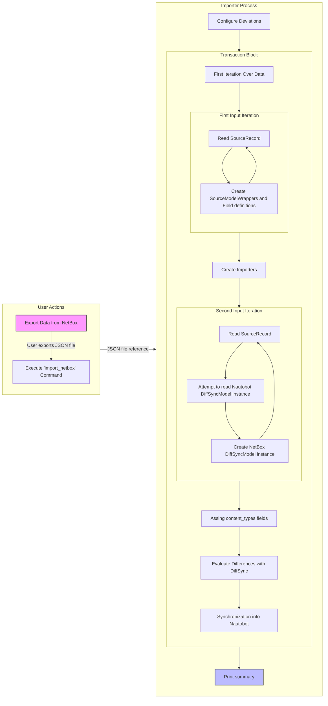

# Data Flow Diagram

A detailed description of the individual steps can be found in the developer [Generator Documentation](../dev//generator.md#stages) or the user [Using the App](../user/app_use_cases.md) documentation.

