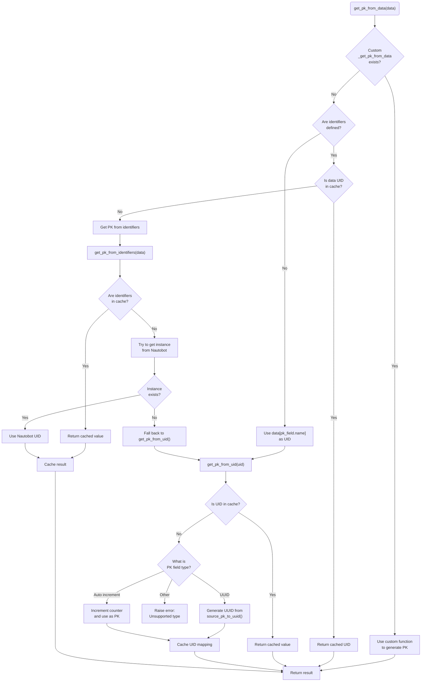

# Nautobot Primary Key Generation Flowchart

Here's a flowchart showing how primary keys are generated in the Nautobot importer, starting with `get_pk_from_data`:

This flowchart shows:

1. How the process starts by checking for a custom function
2. The branching logic based on whether identifiers are defined
3. Multiple caching points to avoid redundant lookups
4. How the system looks for existing Nautobot instances
5. How different field types (UUID vs auto-increment) are handled differently
6. The final caching and return of the result

The process ensures each record gets a consistent primary key that can be reliably referenced throughout the import process.
