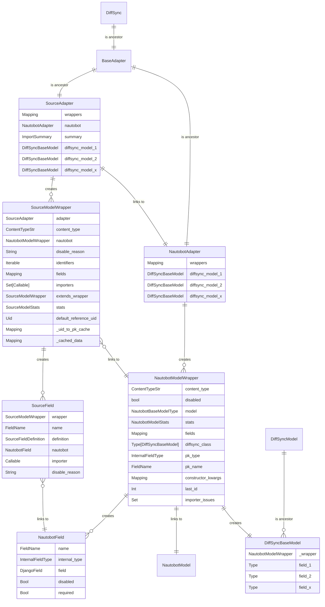

## ER Diagram

Illustrated below is the ER diagram for the generator structure, created to import data from source to Nautobot.

```mermaid
erDiagram
    DiffSync ||--|| BaseAdapter : "is ancestor"
    BaseAdapter ||--|| SourceAdapter : "is ancestor"
    BaseAdapter ||--|| NautobotAdapter : "is ancestor"
    SourceAdapter ||--o{ SourceModelWrapper : "creates"
    SourceModelWrapper ||--o{ SourceField : "creates"
    SourceAdapter ||--|| NautobotAdapter : "links to"
    NautobotAdapter ||--o{ NautobotModelWrapper : "creates"
    SourceModelWrapper }o--|| NautobotModelWrapper : "links to"
    NautobotModelWrapper ||--o{ NautobotField : "creates"
    NautobotModelWrapper ||--|| NautobotModel : "links to"
    SourceField }o--|| NautobotField : "links to"
    NautobotModelWrapper ||--|| DiffSyncBaseModel : "creates"
    DiffSyncModel ||--o{ DiffSyncBaseModel : "is ancestor"
    SourceAdapter {
        Mapping wrappers
        NautobotAdapter nautobot
        ImportSummary summary
        DiffSyncBaseModel diffsync_model_1
        DiffSyncBaseModel diffsync_model_2
        DiffSyncBaseModel diffsync_model_x
    }
    SourceModelWrapper {
        SourceAdapter adapter
        ContentTypeStr content_type
        NautobotModelWrapper nautobot
        String disable_reason
        Iterable identifiers
        Mapping fields
        Set[Callable] importers
        SourceModelWrapper extends_wrapper
        SourceModelStats stats
        Uid default_reference_uid
        Mapping _uid_to_pk_cache
        Mapping _cached_data
    }
    SourceField {
        SourceModelWrapper wrapper
        FieldName name
        SourceFieldDefinition definition
        NautobotField nautobot
        Callable importer
        String disable_reason
    }
    NautobotAdapter {
        Mapping wrappers
        DiffSyncBaseModel diffsync_model_1
        DiffSyncBaseModel diffsync_model_2
        DiffSyncBaseModel diffsync_model_x
    }
    NautobotModelWrapper {
        ContentTypeStr content_type
        bool disabled
        NautobotBaseModelType model
        NautobotModelStats stats
        Mapping fields
        Type[DiffSyncBaseModel] diffsync_class
        InternalFieldType pk_type
        FieldName pk_name
        Mapping constructor_kwargs
        Int last_id
        Set importer_issues
    }
    NautobotField {
        FieldName name
        InternalFieldType internal_type
        DjangoField field
        Bool disabled
        Bool required
    }
    DiffSyncBaseModel {
        NautobotModelWrapper _wrapper
        Type field_1
        Type field_2
        Type field_x
    }
```

