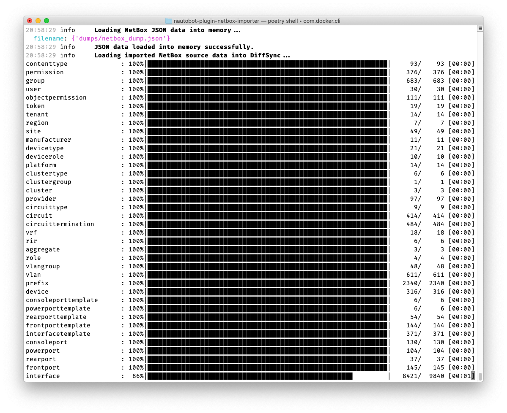
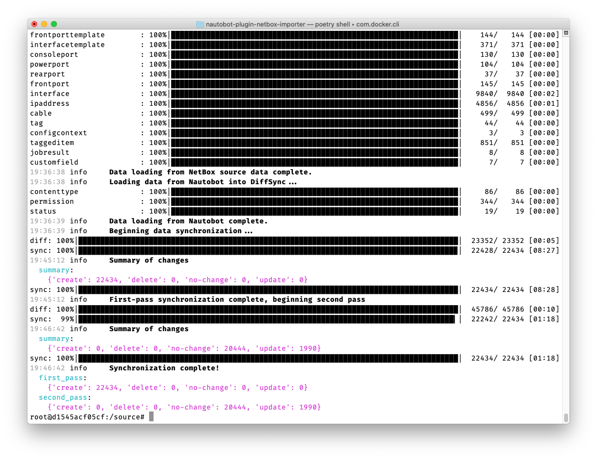

# Using the App

This document describes common use-cases and scenarios for this App.

## General Usage

This plugin provides two separate commands, one for importing data records into Nautobot and one for importing the database changelog into Nautobot as an optional secondary step.

### Importing data records into Nautobot

#### Getting a data export from NetBox

From the NetBox root directory, run the following command to produce a JSON file (here, `/tmp/netbox_data.json`) describing the contents of your NetBox database:

```shell
python netbox/manage.py dumpdata \
    --traceback --format=json \
    --exclude admin.logentry --exclude sessions.session \
    --exclude extras.ObjectChange --exclude extras.Script --exclude extras.Report \
    > /tmp/netbox_data.json
```

#### Importing the data into Nautobot

From within the Nautobot application environment, run `nautobot-server import_netbox_json <json_file> <netbox_version>`, for example `nautobot-server import_netbox_json /tmp/netbox_data.json 2.10.3`.

#### Data validation and error handling

Note that the importer *does* apply Nautobot's data validation standards to the data records as it imports them. If any data records fail data validation, you will see detailed error messages. For example, the following error might be generated if your NetBox data somehow contains a Rack that is assigned to Site-1 but belongs to a RackGroup located at Site-2:

```
09:42:43 error    Nautobot reported a data validation error - check your source data
  action: create
  exception: ['Assigned rack group must belong to parent site (Site-1).']
  model: <class 'nautobot.dcim.models.racks.Rack'>
  model_data:
    {'asset_tag': None,
     'comments': '',
     'custom_field_data': {},
     'desc_units': False,
     'facility_id': ''
     'group': <RackGroup: Cage2>,
     'name': 'Rack-1',
     'outer_depth': None,
     'outer_unit': '',
     'outer_width': None,
     'pk': UUID('25b61428-813b-5d42-b7ea-38cd541c925a'),
     'role': <RackRole: vPOD>,
     'serial': '',
     'site': <Site: Site-1>,
     'status': <Status: Active>,
     'tenant': None,
     'type': '4-post-cabinet',
     'u_height': 42,
     'width': 19}
```

In this case, the import of this Rack into Nautobot will fail, and you may see a series of cascading errors as other objects dependent on this Rack (such as Devices) also fail due to the absence of this Rack.

Normally the correct response to this sort of error is to understand the cause of the error, log into your NetBox instance and correct the invalid data, then re-export the data from NetBox and re-run the importer.

**If**, however, fixing the source data in NetBox is not possible for whatever reason, you **can** instruct the importer to import data *even if it fails Nautobot's data validation checks*, by specifying the option `--bypass-data-validation`. This **will** result in your Nautobot database containing invalid data, which you will want to fix up in Nautobot as soon as possible to avoid unexpected errors in the future.

When using the `--bypass-data-validation` option, data validation checks are still run, but any failures will be logged as warnings (rather than errors), so that you can still be aware of any issues that will need to be remediated in Nautobot.

### Importing change logging (ObjectChange) records

Because the database change log can be a massive amount of data, and often this historical information does not need to be imported, `ObjectChange` records are not included in the database export command above and are not handled by the `import_netbox_json` command. To import `ObjectChange` records specifically, **after** the previous Netbox import process has succeeded, you can do the following.

#### Getting a data export from NetBox with ONLY ObjectChange items

```shell
python netbox/manage.py dumpdata extras.ObjectChange\
    --traceback --format=json \
    > /tmp/netbox_only_objectchange.json
```

#### Importing the ObjectChanges into Nautobot

From within the Nautobot application environment, run `nautobot-server import_netbox_objectchange_json <json_file_without_objectchanges> <json_file_only_objectchanges> <netbox_version>`, for example `nautobot-server import_netbox_objectchange_json imp/script/import_netbox_json.json imp/script/netbox_only_objectchange.json 2.10.3`.


## Use-cases and common workflows

## Screenshots

!!! warning "Developer Note - Remove Me!"
    Ideally captures every view exposed by the App. Should include a relevant dataset.




